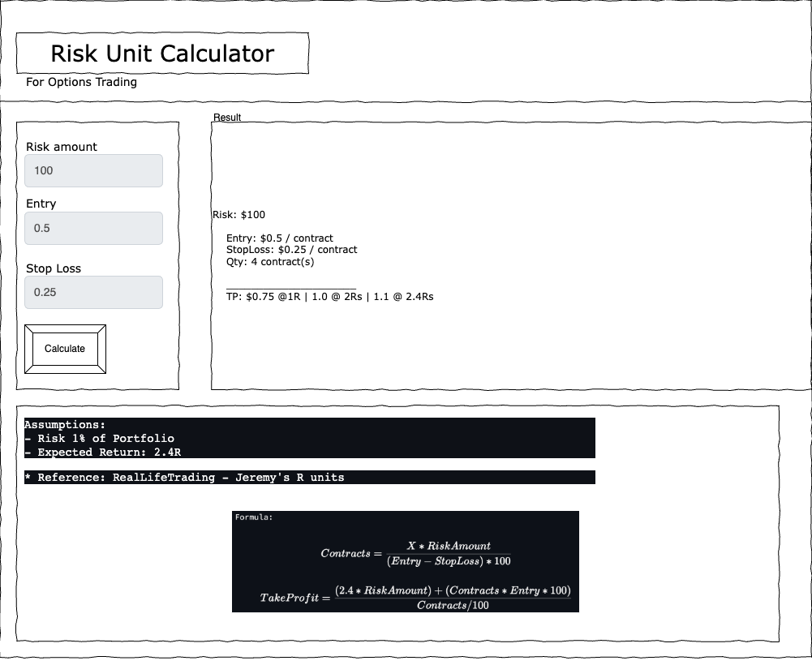

This app is a simple calculator that helps in choosing the correct number of contracts for US options markets based on
* Inputs
  * account size (1% - assumed)
  * entry price
  * stop loss
* Output:
  * Take Profit Price Levels to keep risk in check per each trade

